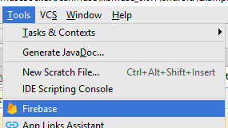
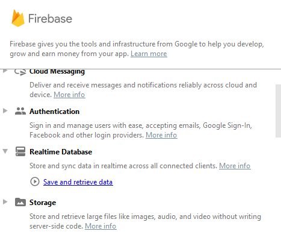
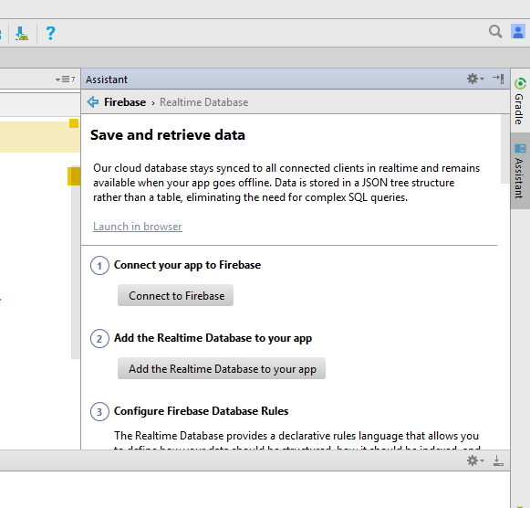
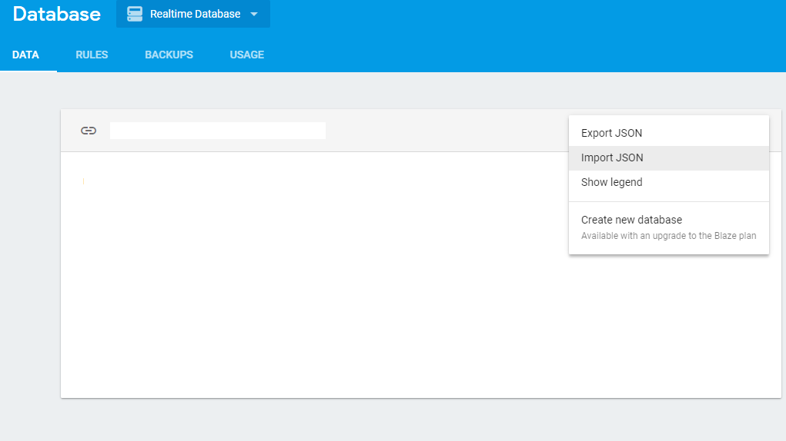
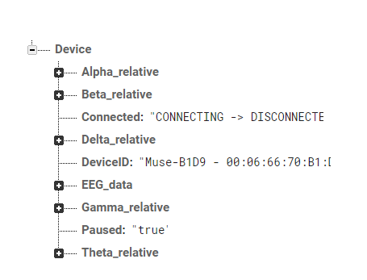

# MuseEEG-FireBase and Web 

Sending Electroencephalography(EEG) data to a webpage via firebase real time database using Muse EEG headset

This is an example built on the muse Android sdk example code modified to communicate EEG data to a webpage. 
It contains firebase hooks in the android app and analogus hooks on the example webpage.

## Installation
1. [create A firbase account] (https://firebase.google.com/?gclid=EAIaIQobChMIqozErZLT2AIVwYuzCh2pzwM4EAAYASAAEgK0s_D_BwE)

For the code to run you need to add a Firebase backend for the code to connect to.

2.	Open the android code and add firbase backend to the project.
	a.	Click tools -Firebase->Realtime Database- save and retrieve data

	
	
	
	
	
	If this does not work you could try this video below.(https://www.youtube.com/watch?v=YVu_xSzn2u0)

3.	Open the html file in the JeanWebmuse-webView folder and add the link from firebase to the correct section.
	a.	To get started using Firebase, see Add Firebase to your JavaScript Project.

```javascript
<script src="https://www.gstatic.com/firebasejs/4.8.2/firebase.js"></script>
<script>
  // Initialize Firebase
  // TODO: Replace with your project's customized code snippet
  var config = {
    apiKey: "<API_KEY>",
    authDomain: "<PROJECT_ID>.firebaseapp.com",
    databaseURL: "https://<DATABASE_NAME>.firebaseio.com",
    storageBucket: "<BUCKET>.appspot.com",
    messagingSenderId: "<SENDER_ID>",
  };
  firebase.initializeApp(config);
</script>
```
If you have any issues see this link [Add Firebase to your Project](https://firebase.google.com/docs/web/setup)	
	

4.	Import the Jason (musetest.json) into your the firebase database for this project 


It should look something like this


5.	Run the code on your android device
6.	Connect the muse headset to the app
7.	once you start seeing data, run the fbtest.html in the browser to see the data from Firebase. This show an example of pulling the data into a web app.
